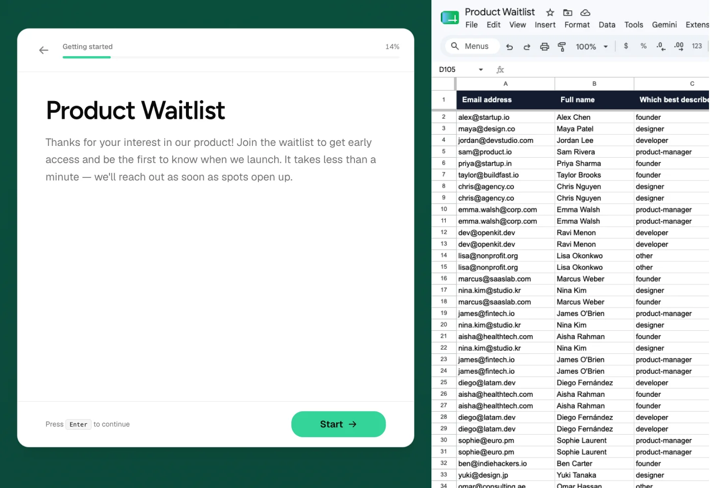

<div align="center">

<p align="center">
  
</p>

# Recto

### Open-source, self-hosted forms synced to Google Sheets.

[](LICENSE)
[](Dockerfile)
[](https://nextjs.org/)
[](https://www.typescriptlang.org/)

No response limits. No paid tiers. Own your data completely on your infrastructure.

<br />

<p align="center">
  
</p>

<br />

[Quick Start](#-quick-start) • [Deployment](#-deployment) • [Full Guide](DEPLOYMENT.md)

---

</div>

## ✨ Why Recto?

Hosted form tools like Typeform, Tally, or Jotform lock responses behind monthly subscriptions and store your data on their servers.

Recto runs on your server (Postgres + S3) and streams form submissions straight into your Google Sheet:

- **Google Sheets Sync**: Submissions write automatically to a Google Sheet tab with formatted column headers.
- **AI Builder**: Generate forms from text prompts using OpenRouter (DeepSeek, Claude, or GPT models).
- **13+ Question Types**: Short Text, Long Text, Multiple Choice, Multi-Select, Phone, Email, Date, File Upload, E-Signature, NPS, Matrix, Rating, and Switch.
- **Self-Hosted**: Runs on Postgres and MinIO/S3. No usage caps, telemetry, or external SaaS dependencies.
- **Production-Ready Deploy**: Scripted Docker setup with Caddy for automatic HTTPS.

---

## 🚀 Quick Start

### Local Setup

Requires **Node.js 20+**, **pnpm**, and **Docker**.

1. **Clone the repository**:
   ```bash
   git clone https://github.com/hddananjaya/recto.git
   cd recto
   ```

2. **Install dependencies**:
   ```bash
   pnpm install
   ```

3. **Start Postgres & MinIO**:
   ```bash
   docker compose up -d db minio
   ```

4. **Configure environment**:
   ```bash
   cp .env.example .env
   ```

5. **Run migrations and start app**:
   ```bash
   pnpm db:migrate
   pnpm dev
   ```

Open [http://localhost:3000](http://localhost:3000).

---

## 🐳 Docker Stack

Run all services together locally:

```bash
cp .env.example .env
docker compose up -d --build
```

Services started:
- `app`: Next.js web application
- `worker`: Background worker for Google Sheets sync
- `db`: PostgreSQL 16
- `minio`: S3-compatible file storage

---

## ⚡ Deployment

Install on a Linux VPS with automated HTTPS:

```bash
curl -fsSL https://raw.githubusercontent.com/hddananjaya/recto/main/scripts/install.sh | \
  bash -s -- \
  --domain recto.yourdomain.com \
  --email admin@yourdomain.com
```

Read [DEPLOYMENT.md](DEPLOYMENT.md) for details on environment secrets, DNS configuration, and backups.

---

## ⚙️ Environment Variables

| Variable | Description | Required |
|---|---|---|
| `AUTH_SECRET` | Key for session encryption | Yes |
| `DATABASE_URL` | PostgreSQL connection string | Yes |
| `S3_*` | S3 bucket & access keys | Yes |
| `GOOGLE_CLIENT_ID` / `SECRET` | Google OAuth credentials | Optional |
| `GOOGLE_SERVICE_ACCOUNT_JSON` | Service account JSON for Sheets | Optional |
| `OPEN_ROUTER_KEY` | OpenRouter key for AI form generation | Optional |

See [`.env.example`](.env.example) for defaults.

---

## 🛠️ Stack

- **Framework**: Next.js 16 (App Router), React 19, Tailwind CSS v4
- **Database**: PostgreSQL 16 with Prisma ORM
- **Storage**: S3 / MinIO
- **Auth**: Better Auth
- **Worker**: Node.js worker for Google Sheets sync

---

## 🤝 Contributing

PRs and issues are welcome.

---

## 📄 License

[MIT License](LICENSE).
